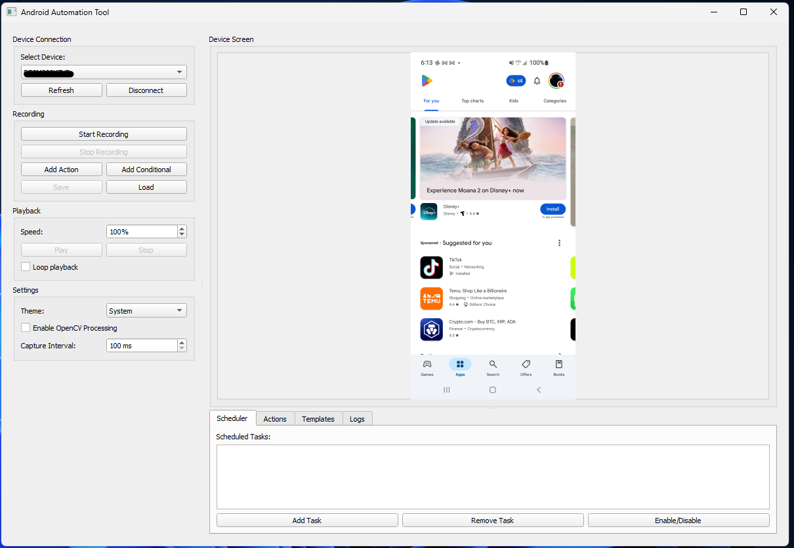

# Android Automation Tool

[](https://www.gnu.org/licenses/agpl-3.0)

A powerful, open-source desktop application for automating interactions with Android devices using Python, ADB, OpenCV, and PyQt5.



## Features

-  **Device Connection**: Connect to any ADB-compatible Android device
-  **Action Recording**: Record taps, swipes, and other interactions
-  **Playback**: Replay recorded actions with adjustable speed
-  **Image Recognition**: Use OpenCV for template matching and visual automation
-  **Scheduling**: Schedule automated tasks to run at specific times
-  **Conditional Logic**: Create if/then/else flows based on screen content
-  **Themes**: Choose between light, dark, or system theme

## Supported Actions

- Tap
- Swipe
- Wait
- Key Events
- Text Input
- Long Press
- Template Matching
- Conditional Actions

## Installation

### Prerequisites

- Python 3.12 or higher
- USB debugging enabled on your Android device

### Setup

1. Clone the repository:
   ```
   git clone https://github.com/bradselph/AndroidAuto.git
   cd AndroidAuto
   ```

2. Install requirements:
   ```
   pip install -r requirements.txt
   ```

3. Run the application:
   ```
   python main.py
   ```

The application will automatically download required drivers (ADB and scrcpy) on first launch.

## Quick Start

1. Connect your Android device via USB
2. Enable USB debugging on your device
3. Launch the application
4. Click "Refresh" and select your device
5. Click "Connect" to establish connection
6. The device screen will appear in the application
7. Start recording actions or create automation scripts

For detailed instructions, see the [User Guide](docs/USER_GUIDE.md).

## Documentation

- [User Guide](docs/USER_GUIDE.md)
- [Contributing Guidelines](docs/CONTRIBUTING.md)
- [Roadmap](docs/ROADMAP.md)

## License

This project is licensed under the GNU Affero General Public License v3.0 - see the [LICENSE](LICENSE) file for details.

## Acknowledgements

- [scrcpy](https://github.com/Genymobile/scrcpy) for screen mirroring capabilities
- [Android Debug Bridge (ADB)](https://developer.android.com/studio/command-line/adb) for device communication
- [OpenCV](https://opencv.org/) for image processing and template matching
- [PyQt5](https://www.riverbankcomputing.com/software/pyqt/) for the GUI framework
